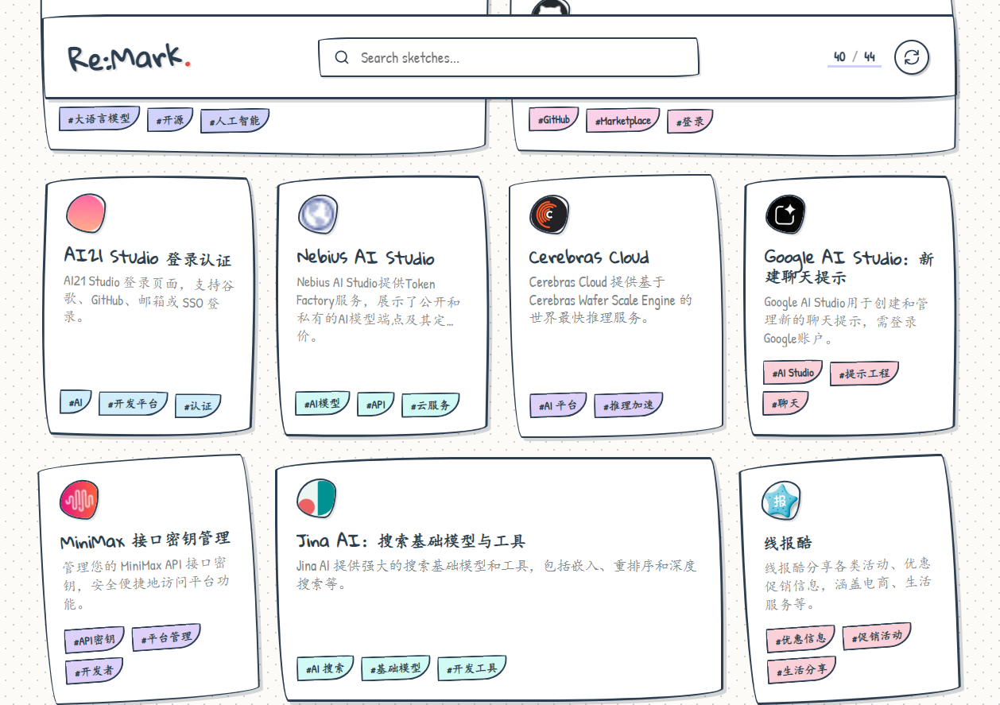

<div align="center">

# Re:Mark

**浏览器书签同步、标题清理与 AI 富化工具**

一个基于原生浏览器书签的知识库：用 GitHub Gist 跨浏览器同步书签，在扩展内清理浏览器书签标题，并可用 AI 为书签生成摘要、标签和封面，Web 端只负责浏览展示。

</div>

---

## ✨ 特性

- 📚 **原生书签优先** - 以浏览器自带的书签管理为核心，不额外绑架数据格式，保持与原生书签一致
- 🔄 **跨浏览器同步** - 使用 GitHub Gist 在 Chrome / Firefox / Edge 间无缝同步
- 🧹 **标题清理** - 扩展直接改写浏览器本地书签标题，减少超长标题和无意义登录/营销文案
- 🤖 **AI 智能富化** - 扩展内调用 AI 和 Jina Auth Reader 提取摘要、标签、封面，让书签更易管理和检索
- 🌐 **简洁 Web 界面** - 提供清爽的 Web 端浏览体验，随时随地查看你的 Gist 书签数据
- 🔒 **数据自托管** - Token 在本地，书签存储在你自己的 Gist，完全掌控数据安全


<div align="center">

</div>

---

## 🚀 快速开始

### 浏览器扩展

#### 安装扩展

1. **Chrome 网上应用店（推荐）**
   - 直接访问 [Chrome 网上应用店 - Re:Mark](https://chromewebstore.google.com/detail/remark/pddjamjepimjeemnpmbhgcfkbkplnfkk) 点击「添加至 Chrome」
   - 安装后在扩展的设置页填写配置（见下方配置说明）
   - 应用商店会自动推送更新，无需手动重新加载

2. **手动加载 / 开发模式**
   - 用于 Edge / Firefox，或需要调试最新版。可在 [Releases](../../releases) 下载打包产物，或在 `extension` 目录运行 `bun install && bun run build` 生成 `extension/.output/`。
   - **Chrome / Edge**
     1. 访问 `chrome://extensions/`（Edge 访问 `edge://extensions/`）
     2. 打开右上角的「开发者模式」
     3. 点击「加载已解压的扩展程序」
     4. 选择 `extension/.output/chrome-mv3` 目录

   - **Firefox**
     1. 运行 `bun run build:firefox` 构建
     2. 访问 `about:debugging#/runtime/this-firefox`
     3. 点击「临时加载附加组件」
     4. 选择 `extension/.output/firefox-mv3/manifest.json`

3. **配置扩展**
   - 在扩展设置中填写 **GitHub Token**（需要 `gist` 权限）
   - Gist ID 可留空，扩展会自动创建
   - 配置 AI API Key 后会显示「清理标题」按钮
   - 配置 AI API Key、Jina API Key，并开启智能富化后，按钮会变为「智能富化」
   - 标题清理/智能富化默认并发数为 10，可在设置页调整；遇到 429 会自动退避重试

4. **打包扩展**（可选）
   - 如需生成 `.crx` 或 `.xpi` 文件，可在浏览器扩展页使用「打包扩展程序」功能

---

### Web 端

#### 方式一：Vercel 部署（推荐）

Vercel 提供免费的托管服务，非常适合部署本项目的 Web 端。

**步骤：**

1. **Fork 本仓库**
   - 点击 GitHub 页面右上角的 `Fork` 按钮，将仓库 Fork 到你自己的账号

2. **导入到 Vercel**
   - 登录 [Vercel](https://vercel.com)
   - 点击 `Add New...` → `Project`
   - 选择 `Import Git Repository`
   - 从列表中选择你刚刚 Fork 的 `remark` 仓库

3. **配置项目**
   - **Root Directory**: 在配置页面中，点击 `Edit` 修改 Root Directory 为 `web`
   - **Environment Variables**: 点击「Environment Variables」部分，添加以下环境变量

4. **添加环境变量**

   完整参考 [`web/.env.example`](web/.env.example) 文件，逐项填入环境变量：

   ```bash
   # GitHub Gist 配置
   GITHUB_TOKEN=your_github_token_here
   GIST_ID=your_gist_id_here

   # Web 主题（可选）
   WEB_THEME=brutalist
   ```

   `WEB_THEME` 可选值：
   - `brutalist`：Neo-Brutalist，高对比粗野风（默认）
   - `editorial`：Soft Editorial，温暖编辑感
   - `terminal`：Terminal Synthwave，终端复古风
   - `minimal`：Japanese Minimalism，和风极简
   - `glass`：Glassmorphism Light，浅色毛玻璃

   `WEB_THEME` 只控制部署后的默认主题。页面右上角也可以直接切换主题，选择会保存到当前浏览器，并覆盖该浏览器里的默认显示。

5. **部署**
   - 点击 `Deploy` 按钮，等待部署完成
   - 部署成功后，访问 Vercel 提供的域名即可查看你的书签库

6. **配置扩展富化**（可选）
   - AI Key、Jina Key、智能富化开关和并发数在扩展设置页配置，Web 端不再执行富化任务

#### 方式二：本地部署

如果你想在本地运行 Web 端：

```bash
cd web
bun install
bun run dev
```

访问 `http://localhost:3000` 即可查看。

---

## 📄 开源协议

本项目采用 [MIT License](LICENSE) 开源协议。

---

## 📮 反馈与贡献

如果你在使用过程中遇到任何问题，或有任何建议和想法，欢迎：

- 提交 Issue
- 提交 Pull Request

---

<div align="center">

**如果这个项目对你有帮助，欢迎 Star ⭐️**

Made with ❤️

</div>
